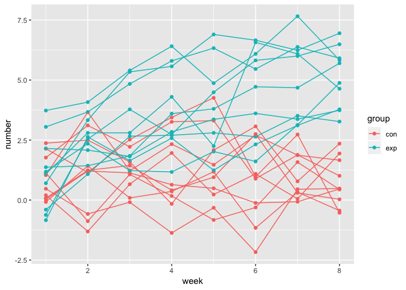
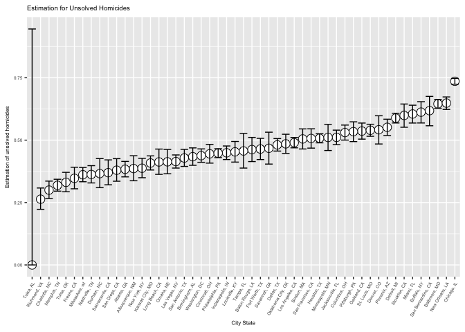

p8105\_hw5\_qw2282
================
Qinyao Wu
11/1/2018

### Problem 1

``` r
#Create the dataframe for filenames. Read the data one-by-one using map. 
data_longitudinal = data_frame(filename = list.files("./data")) %>%
  filter(!filename == "homicide-data.csv") %>% 
  mutate(file_contents = map(filename, ~read_csv(file.path("./data", . )))) %>% 
  unnest() %>% 
  
  #Tidy the name of the files to different variables. 
  separate(filename, into = c("group", "subject"), sep = "_") %>% 
  separate(subject, into = c("subject", "delete")) %>% 
  select(-delete) %>% 
  janitor::clean_names() %>% 
  mutate(subject = factor(subject), group = factor(group)) %>% 
  gather(key = week, value = number, week_1:week_8) %>% 
  separate(week, into = c("delete", "week"), sep = "_") %>% 
  select(-delete) %>% 
  
  #Change the week variable into numeric. 
  mutate(week = as.numeric(week))

#Make the scatter plot.

ggplot(data_longitudinal, aes(x = week, y = number, group = (group:subject), color = group)) +
  geom_point() +
  geom_line() +
  #Add the titles and the x and y axis names. 
  labs(
    title = "Observation of Longitudinal Studies",
    x = "Weeks",
    y = "Observations"
  )
```



According to the spaghetti plot, we can observe that the experimental group have a similar start point(baseline) as the control group. However, as the time passes, the experimental group increases while the control group does not have an obvious change. From the plot, we can summarize that the experimental group have a change, while we still need further statistical analysis to determine whether the change is significant.

### Problem 2

``` r
#Read the data of homicides. 
data_homicide = read.csv(file = "./data/homicide-data.csv") %>% 
  mutate(city_state = str_c(city,", ", state)) %>% 
  select(-city, -state) 
```

The raw data contains 52179 observations and 11 varianbles. The variables contains uid, reported\_date, victim\_last, victim\_first, victim\_race, victim\_age, victim\_sex, lat, lon, disposition, city\_state. This dataset depicts the homicides in 50 large US cities. The data comes from the Wahshington post. We will fist tidy the data by combining the city and state columns, and then tidy the data to calculate the proportion for the unsolved cases. We mainly focus on the proportion of unsolved cases but the characters of the victim are also provided in the data set.

``` r
#Create a function to check whether a case is arrested or unarrested. 
check_arrest = function(disposition) {
  
  #If it is closed by arrest, the case is defined as arrested. 
  if (disposition == "Closed by arrest") {
     "arrested"
    
    #Otherwise, it is defined as unarrested. 
  } else  {
     "unarrested"
  }
}

#Create a new data frame for homicides. 
total_number_homicide = 
  data_homicide %>% 
  
  #Use the function to define each case as arrested or unarrested. 
  mutate(arrest_stage = as.character(map(disposition, check_arrest))) %>% 
  
  #Group the cases together by the arrest stage to see the total number. 
  group_by(city_state, arrest_stage) %>% 
  summarize(total_number = n()) %>% 
  spread(key = arrest_stage, value = total_number) %>% 
  
  #If some city do not have an unarrrested or arrested case, it is defined as 0.
  replace(is.na(.), 0) %>% 
  
  #Add a column for total number. 
  mutate(total_number = arrested + unarrested) 
  

#Check the data for baltimore. 
baltimore_data = total_number_homicide %>% 
  filter(city_state == "Baltimore, MD") 

#Use proportional test for baltimore. 
output_baltimore = prop.test(baltimore_data$unarrested, baltimore_data$total_number) %>% 
  broom::tidy() %>% 
  select(estimate, conf.low, conf.high)

#Display the data for baltimore. 
output_baltimore %>% 
  knitr::kable(digits = 3)
```

|  estimate|  conf.low|  conf.high|
|---------:|---------:|----------:|
|     0.646|     0.628|      0.663|

The estimation for the proportion of unsolved cases are calculated for Baltimore. And we can observe that Baltimore has a relatively high ratio of unsolved crime cases.

``` r
#Create a function to perform proportional test for each data set of cities. 
calculate_proportion = function(data) {
  output = prop.test(data$unarrested, data$total_number) %>% 
  broom::tidy() %>% 
  select(estimate, conf.low, conf.high)
  
  output
}


#Calculate proportion test for each city using map. 
estimation_for_city = total_number_homicide %>% 
  nest(city_state, arrested:total_number) %>% 
  mutate(proportion = map(data, calculate_proportion)) %>% 
  unnest() %>% 
  
  #Sort the city
  mutate(city_state = forcats::fct_reorder(factor(city_state), estimate))  
```

    ## Warning in prop.test(data$unarrested, data$total_number): Chi-squared
    ## approximation may be incorrect

``` r
  #Make the bar plot. 
ggplot(estimation_for_city, aes( x = city_state, y = unarrested/total_number)) +
  geom_bar(stat = "identity") +
  
  #Add the error bar. 
  geom_errorbar(aes(x = city_state, ymin = conf.low, ymax = conf.high)) +
  theme(text = element_text(size = 8), axis.text.x = element_text(angle = 60, hjust = 1)) + 
  
  #Add the title and the name for x and y axis. 
  labs(
    title = "Estimation for Unsolved Homicides",
    x = "City State",
    y = "Estimation of unsolved homicides"
  )
```



From the organized plot of proportion of unsolved crime cases, we can first observe that in Tulsa, AL, there is no unsolved cases while there is only a total of one homicide happened. This might be caused by two reasons: the first one is that Tulsa is a very safe city and the total number of homicide is very low. And because of that, the sample size is very small and the confidence interval is from 0 to 1. And the second reason is that this might be caused by a information misinput.

However we can still observe the general distribution of the proportion of unsolved homivides. The overall range is from 0.25 to 0.75 while chicago has the highest proportion of unsolved homicides and Richmond has the lowest proportion if we exclude Tusla.
